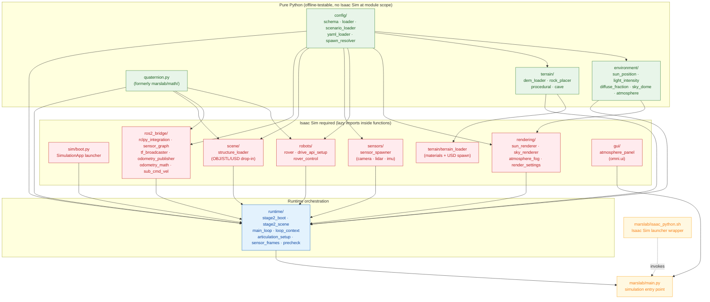

# MarsLab Architecture

> A single-page reference for navigating the MarsLab codebase.
> Each diagram below is rendered automatically by GitHub's Mermaid support.
> All paths are relative to the repository root.

---

## 1. Three-tier directory layout

```
MarsLab/
├── marslab/            Python package + simulation entry (main.py + isaac_python.sh).
│                       Configs are validated here, and every Isaac Sim scene
│                       is assembled by main.py.
│
├── tools/              External-user, one-shot setup utilities.
│                       HiRISE DEM → npy / URDF → USD / integration test runner /
│                       URDF inertia fixer. Sample DEM-conversion config under
│                       tools/dem_conversion/.
│
├── dev/                Maintainer-only tools. Not part of pip install.
│   ├── analysis/        DEM-region candidate finder.
│   ├── asset_gen/       Blender rock OBJ + PBR texture generators (one-shot).
│   ├── configs/         mars_env.yaml — minimal flat-config fixture used by
│   │                    visualize_* defaults and a few unit tests.
│   └── visualize/       Offline figure scripts (atmosphere / dynamic atmosphere /
│                        cave / scenario). Generate paper figures without Isaac Sim.
│
├── configs/            Simulation inputs (the only YAML the runtime reads).
│   ├── robots/          rover_m2020.yaml — single-rover physics + sensors + ROS2.
│   └── scenarios/       _base.yaml + 8 scenarios + 2 self-contained templates.
│
├── assets/             Static assets pulled at runtime.
│   ├── m2020-urdf-models/   NASA JPL m2020 URDF + meshes (git submodule).
│   ├── mars_assets/         DEM/<region>/elevation.npy + metadata.json,
│   │                        mars_rocks/{meshes,textures}, mars_sky/, space_assets/,
│   │                        mars_terrain_texture/.
│   └── robots/rover/        Converted M2020 USD (output of tools/convert_urdf_to_usd.py).
│
├── tests/              Pytest suite.
│   ├── unit/                Pure-Python, no Isaac Sim (~1230 tests).
│   ├── integration/         Isaac-Sim-required (run via tools/run_integration_test.py).
│   ├── fixtures/            Test data (e.g. sample_rock.obj for structure_assets).
│   └── visual_inspection/   Manual checklist for renderings/sensors.
│
├── launch/             ROS2 launch files (rover_state_publisher.launch.py).
├── docs/               User-facing docs (scenario_format.md, frame_conventions.md, ...).
└── work_log/           Append-only development log + references + reviewer audits.
```

---

## 2. `marslab/` sub-package dependency graph



**Reading the graph.** Green nodes have no Isaac Sim imports at module scope and are exercised by the unit test suite. Red nodes need a live Isaac Sim runtime and are only imported via `marslab/main.py` after `SimulationApp()` resolves. Blue is the runtime orchestrator that bridges the two. Yellow is the entry point.

`config/` is the only shared dependency across every module — every other arrow points away from it.

---

## 3. Simulation boot sequence

```mermaid
sequenceDiagram
    autonumber
    actor User
    participant Sh as marslab/isaac_python.sh
    participant Main as marslab/main.py
    participant Loader as config.loader<br/>load_and_validate
    participant Boot as runtime.stage2_boot<br/>run_stage2_boot
    participant App as Isaac Sim<br/>SimulationApp
    participant Scene as runtime.stage2_scene<br/>setup_stage2_scene
    participant Rover as robots.rover<br/>spawn_rover
    participant Sens as sensors.sensor_spawner<br/>spawn_sensors
    participant Graph as ros2_bridge.sensor_graph<br/>build_sensor_graph
    participant Drive as robots.drive_api_setup<br/>configure_drives
    participant Articu as Articulation<br/>(world.reset + initialize)
    participant Bridge as ros2_bridge.rclpy_integration<br/>init_rclpy_side
    participant Ctx as runtime.loop_context<br/>build_loop_context
    participant Loop as runtime.main_loop<br/>run_main_loop

    User->>Sh: marslab/isaac_python.sh<br/>marslab/main.py --config <yaml>
    Sh->>Main: exec Isaac Sim python<br/>(after stripping system ROS2 env)
    Main->>Loader: load + pydantic-validate scenario YAML
    Loader-->>Main: MarsLabConfig (scenario + _base.yaml deep-merged)
    Main->>Boot: run_stage2_boot(config_path)
    Boot-->>Main: StageTwoBootResult<br/>(terrain + atmosphere + DEM paths)

    Note over Main,App: --no-rover branches off here<br/>(skip every rover-only step)

    Main->>App: SimulationApp({headless, renderer})
    Main->>Scene: setup_stage2_scene(boot)
    Scene-->>Main: world + stage + render_config<br/>+ terrain mesh + sun/sky/fog
    Main->>Rover: spawn_rover(stage, rover_cfg, usd_abs, spawn_xyz)
    Rover-->>Main: chassis_path + rigid_body_path
    Main->>Sens: spawn_sensors(stage, sensors_cfg, ros2_cfg, rigid_body_path)
    Sens-->>Main: handles (camera/lidar_3d/lidar_2d/imu prim paths)
    Main->>Graph: build_sensor_graph(...)
    Main->>Drive: configure_drives(stage, chassis_path, control_cfg)
    Main->>Articu: world.reset() + articulation.initialize()<br/>+ pin_articulation_root_pose<br/>+ apply_initial_joint_positions
    Main->>App: warmup loop (10 world.step + timeline.play + 5 step)
    Main->>Drive: reinforce_pd_gains
    Main->>Bridge: init_rclpy_side(ros2_cfg, sensor_frames, ...)
    Bridge-->>Main: BridgeContext (rclpy node + cmd_vel + odom + static TFs)
    Main->>Ctx: build_loop_context(simulation_app, world, ..., bridge)
    Ctx-->>Main: LoopContext (rover handles + atmosphere callbacks)
    Main->>Loop: run_main_loop(ctx)
    Loop-->>User: Per-frame Mars sim<br/>(Ctrl+C to exit)
    Loop-->>Main: exit code 0
    Main->>App: simulation_app.close()<br/>(os._exit(1) if it raises)
```

---

## 4. Per-frame data flow inside `run_main_loop`

```mermaid
graph LR
    cmdvel[/rover/cmd_vel<br/>geometry_msgs/Twist/]
    spin[ctx.spin_once<br/>rclpy.spin_once]
    twist[BridgeContext.twist_state<br/>v · w]
    sat[clip to v_max / w_max]
    ack[robots.rover_control<br/>ackermann_command]
    ramp[_apply_ramp<br/>+ steer ramp]
    artset[articulation.set_joint_<br/>position/velocity_targets]

    physx[(PhysX step<br/>world.step)]
    pose[articulation.get_world_poses<br/>+ velocities]
    odom[ros2_bridge.odometry_publisher<br/>publish_odometry]
    odomtopic[/rover/odom<br/>+ optional /tf odom→base_link/]

    imu[imu.get_current_frame]
    imutopic[/rover/imu/data<br/>via OmniGraph/]
    lidar3d[OmniGraph<br/>RTX LiDAR ROS2 publisher]
    lidartopic[/rover/lidar/points<br/>+ /rover/scan/]
    rgb[OmniGraph<br/>RGB + depth publisher]
    rgbtopic[/rover/rgb/image_raw<br/>/rover/depth/image_raw<br/>/rover/depth/points/]

    state[atmosphere_dict<br/>tau · sun_mode · az/el · time_of_sol]
    sun[environment.sun_position<br/>compute_sol_sun_position]
    intensity[environment.light_intensity<br/>compute_direct_intensity<br/>(Beer's Law)]
    diffuse[environment.diffuse_fraction<br/>compute_diffuse_fraction<br/>(COMIMART)]
    sky[environment.sky_dome<br/>compute_sky_dome_params]
    sunR[rendering.sun_renderer<br/>update_sun_light]
    skyR[rendering.sky_renderer<br/>update_sky_dome]
    fogR[rendering.atmosphere_fog<br/>configure_atmosphere_fog]
    panel[gui.atmosphere_panel<br/>update_display]

    cmdvel --> spin --> twist --> sat --> ack --> ramp --> artset --> physx
    physx --> pose --> odom --> odomtopic
    physx --> imu --> imutopic
    physx --> lidar3d --> lidartopic
    physx --> rgb --> rgbtopic

    state -->|every N frames| sun --> intensity
    sun --> diffuse
    sun --> sky
    intensity --> sunR
    diffuse  --> skyR
    sky      --> skyR
    intensity --> fogR
    sunR --> physx
    skyR --> physx
    fogR --> physx
    state --> panel

    classDef ros   fill:#e1f5fe,stroke:#0277bd,color:#01579b
    classDef sim   fill:#ffebee,stroke:#c62828,color:#b71c1c
    classDef phys  fill:#e8f5e9,stroke:#2e7d32,color:#1b5e20
    classDef topic fill:#fff8e1,stroke:#f9a825,color:#f57f17

    class cmdvel,odomtopic,imutopic,lidartopic,rgbtopic topic
    class spin,artset,pose,imu,lidar3d,rgb,physx sim
    class twist,sat,ack,ramp,odom,sunR,skyR,fogR,panel ros
    class state,sun,intensity,diffuse,sky phys
```

**Reading the graph.** Two parallel streams run inside `run_main_loop` (`marslab/runtime/main_loop.py:469-528`):

* **Rover-step stream (top, every step):** ROS2 `cmd_vel` → Ackermann + saturation/ramp → `articulation.set_*_targets` → PhysX `world.step` → world poses + IMU + LiDAR + RGB → ROS2 topics. Skipped entirely when `ctx.articulation is None` (the `--no-rover` scene-only path).
* **Atmosphere stream (bottom, every `N = mars_env.dynamic_atmosphere.update_interval_frames` steps):** mutable `atmosphere_dict` → `compute_sol_sun_position` → Beer's Law direct + COMIMART diffuse + sky-dome params → renderer updates → physx step picks up new lighting on the next frame. The optional `AtmospherePanel` writes `tau` and `sun_mode` into the same dict from the GUI thread.

---

## 5. Where to start reading

1. `CLAUDE.md` + `README.md` — overall intent, OP-1~5, version timeline.
2. `configs/scenarios/_base.yaml` + `configs/scenarios/jezero_flat.yaml` + `configs/robots/rover_m2020.yaml` — actual simulation inputs.
3. `marslab/main.py` — boot sequence in 440 lines.
4. `marslab/runtime/{stage2_boot,stage2_scene,main_loop,loop_context,precheck}.py` — five core orchestration modules.
5. `marslab/{config/schema, environment, terrain}/` — schema + Mars physics + DEM/Golombek rocks.

`dev/`, `tools/`, and `tests/` are best read after the above five steps so the role of each tool is already clear.
