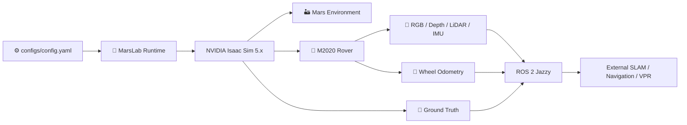
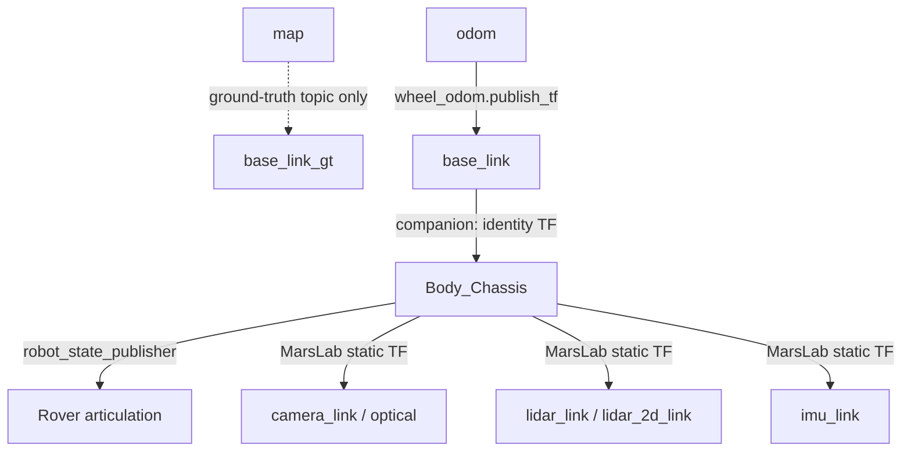

<div align="center">

# 🚀 MarsLab

### A Martian Rover Simulator for Planetary Rover Autonomous Navigation

**Hoyun Kim · Beomsu Kim · Giseop Kim**<br />
*Department of Robotics and Mechatronics Engineering, DGIST*

<p>
  <a href="https://kimhoyun-robotair.github.io/MarsLab/">
    
  </a>
  &nbsp;
  <a href="https://kimhoyun-robotair.github.io/MarsLab/MarsLab.pdf">
    
  </a>
  &nbsp;
  <a href="https://drive.google.com/drive/folders/1evy98zVN0zn-F4Ga3ATRxnYj0xcarkEK?usp=drive_link">
    
  </a>
</p>

<p>
  
  
  
  
</p>

<br />

<a href="https://www.youtube.com/watch?v=gkr9NTTGlTw">
  
</a>
<br />
<a href="https://www.youtube.com/watch?v=gkr9NTTGlTw">▶ Watch the MarsLab video on YouTube</a>

</div>

<br />

> **MarsLab** is a configuration-driven NVIDIA Isaac Sim 5.x platform for
> controlled planetary-rover autonomy and navigation research. It combines
> Martian terrain, an M2020 rover, physically grounded sensors, atmospheric
> rendering, vehicle control, evaluation ground truth, wheel odometry, and an
> optional ROS 2 Jazzy bridge in one runtime.

---

> [!IMPORTANT]
> **🚧 Scene Generation v2.0 — In Development**
>
> We are preparing Version 2.0 of MarsLab's scene-generation pipeline,
> with improved photorealism and more detailed modeling of the Martian
> environment and its physical properties.
>
> Scene-generation tools are currently not included in this repository.
> Please stay tuned for future updates.

## 🧭 Overview

Every run is defined by one validated configuration document,
[`configs/config.yaml`](configs/config.yaml). MarsLab validates the configuration
and required assets before Isaac Sim starts, loads the selected scene, spawns
the rover, runs the simulation loop, and releases runtime resources in reverse
order at shutdown.

This repository provides the rover runtime for prebuilt USDZ environments.
Scene generation, trajectory followers, and experiment/evaluation pipelines
are outside the current distribution. External applications can use the ROS
interfaces below.



### ✨ Highlights

- 🏜️ **Configurable Martian environments** — select supplied USDZ scenes and tune
  gravity, sunlight, atmospheric dust, fog, and sky-dome appearance.
- 🛞 **M2020 rover dynamics** — retain link masses with geometry-based CoM/inertia
  estimates and a passive rocker differential; configure chassis damping, wheel
  contact, rocker-bogie damping, steering, drive gains, control limits, and spawn
  behavior. The controller supports curved driving and pivot turns.
- 📷 **Multi-modal sensing** — RGB, depth, camera PointCloud2, CameraInfo, 2-D
  LaserScan, 3-D LiDAR, raw/noisy IMU, and configurable wheel-odometry and optional
  depth noise derived from the sensor seed.
- 🤖 **ROS 2 integration** — standard topics, simulation clock, joint states,
  robot description, QoS profiles, static sensor frames, and odometry TF control.
- 🧭 **Evaluation-ready motion outputs** — independent ground-truth and wheel
  odometry streams with distinct frames and ownership.
- 🔁 **One runtime configuration** — all active runtime settings live in one
  strict YAML document validated before Kit creation.
- 🖥️ **GUI and headless modes** — use the same configuration for interactive
  atmosphere studies or unattended simulation.

---

## Atmosphere defaults

Runs start at **tau=0.05** with a fixed manual sun. The GUI supports tau=0.05–6
and sun elevation 0–90°; Auto Sweep continues from the latest sun angles. The sun
uses Beer-law direct irradiance. Diffuse light evaluates a tau-indexed NIR
COMIMART reduction at fixed reference conditions and applies a configurable
sky-dome gain; simple fog remains an appearance approximation. See the
[model conditions](assets/atmosphere/README.md).
See the [model limits and atmosphere settings](CONFIGURATION_GUIDE.md#mars-environment-and-atmosphere)
before interpreting lighting values as physical measurements.

## 🏜️ Research Environments

The supplied configuration selects Jezero Plain. Other prebuilt environments
include Main Crater, Grand Canyon, and Mars Base. Select a USDZ and adjust its
runtime illumination and atmospheric appearance.

<table>
<tr>
<td width="33%" align="center" valign="top">


**Mars Base**<br />
Landmark-rich structured terrain.

</td>
<td width="33%" align="center" valign="top">


**Main Crater**<br />
Open crater terrain with sparse structure.

</td>
<td width="33%" align="center" valign="top">


**Mars Canyon**<br />
Long-range terrain with challenging geometry.

</td>
</tr>
</table>

Paper benchmark results and recorded demonstrations of environments,
illumination changes, and dust are available on the
[**MarsLab Project Page**](https://kimhoyun-robotair.github.io/MarsLab/).

---

## 📋 Requirements

| Component | Requirement |
|:---|:---|
| **Operating system** | Linux supported by Isaac Sim 5.x |
| **NVIDIA Isaac Sim** | 5.x |
| **ROS 2** | Jazzy, optional and required only for ROS interfaces |
| **Python** | 3.11+ for offline configuration and utility work |
| **GPU** | NVIDIA GPU supported by the selected Isaac Sim renderer |
| **Rover assets** | M2020 URDF and meshes from the required git submodule |
| **Scene asset** | A downloaded Mars scene referenced by `scene.usdz_path` |

> [!IMPORTANT]
> Isaac Sim and system ROS 2 are separate environments. Do not source the
> system ROS setup script in the terminal used to launch MarsLab.

---

## ⚙️ Installation

### 1. Clone MarsLab and its rover submodule

```bash
git clone --recursive https://github.com/kimhoyun-robotair/MarsLab.git
cd MarsLab
```

If the repository was cloned without `--recursive`, initialize the required
M2020 URDF submodule afterward:

```bash
git submodule update --init --recursive
```

The submodule is installed at:

```text
assets/m2020-urdf-models
```

### 2. Download the Mars scene assets

Download the scene package from
[**Google Drive — MarsLab Scene Assets**](https://drive.google.com/drive/folders/1evy98zVN0zn-F4Ga3ATRxnYj0xcarkEK?usp=drive_link),
then extract or copy the scene directories into `assets/scene/`.

The supplied configuration expects this default file:

```text
assets/scene/
└── jezero_plain/
    └── jezero_plain.usdz
```

Other downloaded environments can be stored beside `jezero_plain`. Select one
by changing `scene.usdz_path` in `configs/config.yaml`. MarsLab consumes these
assets as inputs; it does not generate or convert terrain during startup.

### 3. Optional: install the offline Python package

For configuration validation, environment calculations, and CPU-safe utility
work, install MarsLab in a regular Python environment:

```bash
python3 -m pip install -e .
```

> [!NOTE]
> Isaac Sim provides the Python interpreter used by the simulator. Installing
> the package above does not replace the Isaac Sim installation.

By default, the launcher looks for Isaac Sim at `$HOME/isaacsim`. If Isaac Sim
is installed elsewhere, set its installation directory for the current shell:

```bash
export ISAAC_SIM_PATH=/path/to/isaacsim
```

---

## 🚀 Quick Start

MarsLab and its ROS 2 companion run in **separate terminals**.

<table>
<tr>
<td width="50%" valign="top">

### 🖥️ Terminal 1 — Isaac Sim

Do **not** source system ROS in this terminal.

```bash
marslab/isaac_python.sh \
  marslab/main.py \
  --config configs/config.yaml
```

The wrapper starts Isaac Sim's bundled Python and supplies its bundled Jazzy
bridge libraries to the child process.

</td>
<td width="50%" valign="top">

### 🤖 Terminal 2 — ROS 2

Use with `runtime.ros2_enabled: true`.

```bash
source /opt/ros/jazzy/setup.bash
ros2 launch \
  launch/rover_state_publisher.launch.py
```

The companion uses the `rover` namespace by default and consumes the runtime's
joint states.

</td>
</tr>
</table>

> [!TIP]
> Set `urdf_path:=...` or `namespace:=...` only when the corresponding URDF path
> or namespace in `configs/config.yaml` is changed as well.

Keep both files in `launch/`. The launch file loads
[`companion_urdf.py`](launch/companion_urdf.py) to prepare a `Body_Chassis`-rooted
URDF and resolve relative mesh paths for ROS. It then starts
`robot_state_publisher` and the identity `base_link → Body_Chassis` connector.

### Startup sequence

1. Load and strictly validate `configs/config.yaml`.
2. Resolve configuration-relative asset paths and check required files.
3. Start Isaac Sim and create the Mars world.
4. Reference the selected terrain and rover USD assets.
5. Apply YAML-owned rover physics and create Camera, IMU, and 2-D/3-D LiDAR sensors.
6. Initialize optional atmosphere GUI and ROS 2 interfaces.
7. Enter the simulation, control, sensing, and publication loop.

The World owns one PhysicsScene with the configured Mars gravity. PhysicsScenes
inside the referenced terrain are disabled in the runtime session layer, and
their effective simulation owners are redirected to the World scene.
The input assets remain unchanged.

---

## 🔧 Configuration

[`configs/config.yaml`](configs/config.yaml) is the **only active runtime input**.

| Section | Purpose |
|:---|:---|
| `scene` | Downloaded Scene USDZ path |
| `runtime` | GUI/headless, ROS 2, and atmosphere switches |
| `mars_env` | Gravity, dust, sunlight, sol timing, and dynamic atmosphere |
| `rendering` | Ray/path tracing, sky dome, sun, and fog |
| `rover` | Assets, spawn, physics, control, sensors, ROS names, and QoS |
| `wheel_odom` | Dynamic `odom → base_link` TF ownership gate |

Selected settings from the supplied configuration:

```yaml
scene:
  usdz_path: ../assets/scene/jezero_plain/jezero_plain.usdz

runtime:
  headless: false
  ros2_enabled: true
  atmosphere_enabled: true

rendering:
  mode: ray_tracing

wheel_odom:
  publish_tf: true
```

For renderer modes, scene and spawn selection, atmosphere tuning, rover physics,
sensor profiles, ROS QoS, frame ownership, and odometry parameters, read the
**[Configuration and Tuning Guide](CONFIGURATION_GUIDE.md)** before editing the
YAML.

---

## 📡 Runtime Interfaces

With ROS 2 enabled, the supplied configuration exposes:

| Interface | Default topic | Notes |
|:---|:---|:---|
| Command input | `/rover/cmd_vel` | `geometry_msgs/Twist` |
| RGB image | `/rover/rgb/image_raw` | Shared Camera render product |
| Depth image | `/rover/depth/image_raw` | Shared Camera render product |
| Camera point cloud | `/rover/depth/points` | XYZ `sensor_msgs/PointCloud2` |
| Camera calibration | `/rover/rgb/camera_info` | `sensor_msgs/CameraInfo` |
| Raw IMU | `/rover/imu` | `imu_link` |
| Noisy IMU | `/rover/imu_noisy` | Seeded noise stream |
| 2-D LiDAR | `/rover/scan` | `sensor_msgs/LaserScan`, `lidar_2d_link` |
| 3-D LiDAR | `/rover/lidar/points` | `lidar_link` |
| Joint states | `/rover/joint_states` | Consumed by the companion |
| Robot description | `/rover/robot_description` | Companion-owned latched URDF text |
| Ground truth | `/rover/GT_Trajectory` | `map → base_link_gt`, topic only |
| Wheel odometry | `/rover/odom` | `odom → base_link` |
| Simulation clock | `/clock` | Isaac simulation time |

Ground truth never publishes TF. `wheel_odom.publish_tf` is the only MarsLab
switch for dynamic `odom → base_link` TF ownership.

The supplied sensor settings are:

| Sensor | Field of view | Configured distance limits |
|:---|:---|:---|
| Camera at the left Navcam mast reference | 135° horizontal, about 122.18° vertical | 0.3–200 m along the optical axis |
| 2-D LiDAR | Forward 135° output sector | 0.2–200 m |
| 3-D LiDAR | 220° horizontal, 45° vertical | 3.5–200 m |

Depth noise is disabled by default. Camera PointCloud2 contains XYZ fields.
The 2-D sensor acquires a full rotation internally and crops its output to the
forward sector. Range settings are limits; actual returns depend on visibility,
surface response, and scene geometry. See the sensor sections in the
[configuration guide](CONFIGURATION_GUIDE.md#sensors).

---

## 🧩 System Ownership



- The ROS companion owns identity `base_link → Body_Chassis` and the URDF
  articulation chain.
- MarsLab owns retained sensor static frames below `Body_Chassis`.
- Ground truth is an evaluation stream and owns no TF.
- Wheel odometry is the operational estimate and may own dynamic odometry TF.

The default rover references `m2020_lidar.usda`; its companion uses
`m2020_lidar.urdf`. Both add modeled sensor housings and mounts to the preserved
rover asset, with merged chassis mass, COM and inertia. These are research
attachments, not flight Perseverance instruments. See
[mount assumptions and mass properties](assets/robots/sensors/mass_properties.json).

---

## 📂 Project Structure

<details open>
<summary><b>Repository layout</b></summary>

```text
MarsLab/
├── README.md
├── CONFIGURATION_GUIDE.md
├── configs/
│   └── config.yaml                 # Canonical runtime configuration
├── assets/
│   ├── scene/                      # Downloaded Mars terrain USDZ inputs
│   ├── robots/                     # Rover USD and physics layers
│   ├── mars_sky/                   # Sky-dome image assets
│   ├── atmosphere/                 # Model references and scope
│   └── m2020-urdf-models/           # Required URDF git submodule
├── launch/
│   ├── rover_state_publisher.launch.py
│   └── companion_urdf.py           # Companion URDF preparation
├── docs/                           # Project page and recorded browser demo
├── marslab/
│   ├── main.py                     # Runtime entry point
│   ├── isaac_python.sh             # Isaac Python launcher
│   ├── config/                     # YAML loading and strict schemas
│   ├── environment/                # Isaac-free Mars calculations
│   ├── gui/                        # AtmospherePanel
│   ├── rendering/                  # Sky, sun, fog, and render settings
│   ├── robots/                     # Rover physics and control
│   ├── ros2_bridge/                # Topics, QoS, TF, and odometry
│   ├── runtime/                    # Assembly, loop, and cleanup lifecycle
│   ├── sensors/                    # Camera, IMU, and 2-D/3-D LiDAR
│   └── sim/                        # SimulationApp and world bootstrapping
└── pyproject.toml                  # Package and tooling metadata
```

</details>

---

## ✅ Validation Boundary

Offline checks can validate YAML structure, asset paths, schemas, and pure
computation. Isaac GUI appearance, rover physics, live sensor data, ROS topics,
QoS and TF, AtmospherePanel behavior, and shutdown cleanup must be verified in
the user's Isaac Sim and ROS installation.

For a chosen configuration, observe sensor messages, frame ownership, actual
rover steering, and Pause/Stop/Play behavior. Record the configuration, input
assets, and actual observations when reporting runtime results. A shared seed
controls MarsLab's custom noise streams; repeatability of complete physics and
rendered outputs requires separate verification.

---

# 🔭 Future Work

Planned improvements include:

- [x] Add 2D LiDAR.
- [ ] Integrate evaluation workflows for TUM, path planning, and SLAM.
- [ ] Integrate Nav2.
- [ ] Extend the existing Gaussian noise with sensor bias and time-varying drift models.
- [ ] Resolve vibration issues during runtime rendering.
- [ ] Improve the realism of sky and light rendering.
- [ ] Add photorealistic scene generation.
- [ ] Add wheel traces.
- [ ] Add support for multiple and heterogeneous robots.
- [ ] Dockerize MarsLab.
